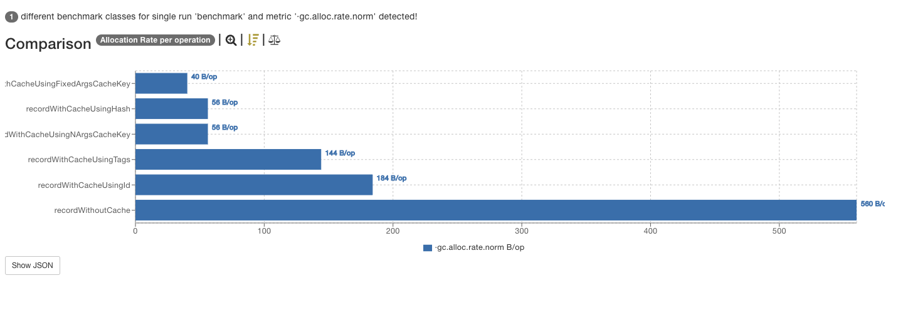

## Comparison of meter interactions
The following scenarios were considered,
* No Caching and the operation is directly called on the meter fluent builder.
* A static object is used to store the meter and operations are performed directly on it.
* Tags are used as meter-cache key.
* Meter.Id is used a cache-key.
* 2 Custom objects are used as Cache keys.

For caching scenarios, the cache and cache look-up time is not covered. Instead, the object creation costs and the memory allocations are considered. We might need to simulate that also to lay down an inclusive cache.

See the below benchmark results when one meter-filter to add a common tag is added to the registry,
1. Average Time 
2. Memory Allocation per interaction
